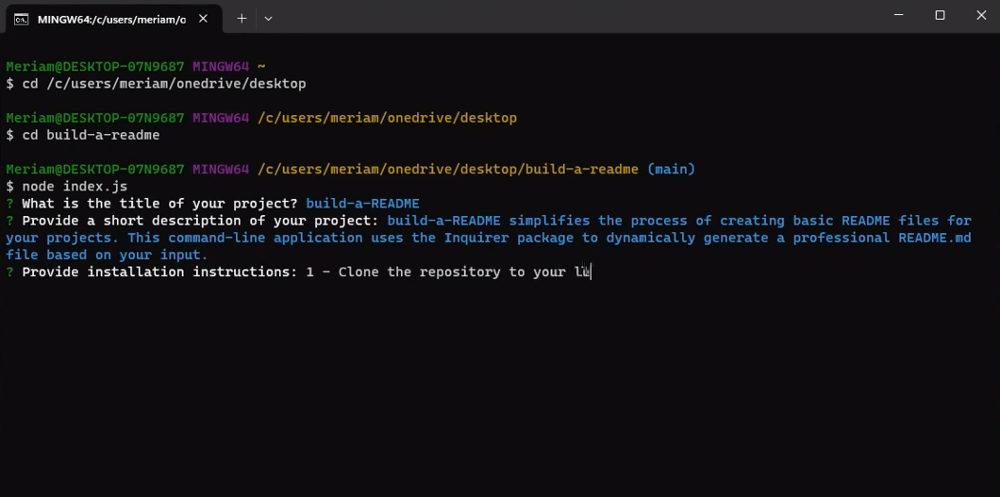

# Build-a-README

## Description

build-a-README simplifies the process of creating basic README files for your projects. This command-line application uses the Inquirer package to dynamically generate a professional README.md file based on your input.

- **Photo Preview:**

  
  
- **Video:** [Link to Video](https://drive.google.com/file/d/1sSYI_zIvlBiwRb7L-aF9qT8O3Jwx8IBt/view)

## Table of Contents

- [Installation](#installation)
- [Usage](#usage)
- [License](#license)
- [Contributing](#contributing)
- [Tests](#tests)
- [Questions](#questions)

## Installation

1 - Clone the repository to your local machine.

2 - Execute npm install to install the necessary dependencies.

3 - Launch the application with node index.js to initiate the README generation process.

## Usage

This tool saves time, ensures consistency, and enhances the user-friendliness of your projects by automating the documentation process.

## License

This project is licensed under the [MIT License](License).

## Contributing

- edX: For providing a learning platform.
- MDN Web Docs: For source of documentation.
- GitHub: For version control and project hosting.

## Tests

No specific tests are required for this project. Feel free to contribute without the need for additional testing.

## Questions

GitHub: [Msalarzon](https://github.com/Msalarzon)
Email: mbsalarzon@gmail.com
